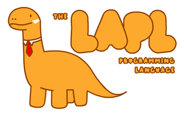

<p align="center">
  
  <br><br>
  
  
  <a href="https://www.freenode.net"></a>
  <!--<a href="https://travis-ci.org/Lartu/ldpl"></a>-->
</p>

**LAPL** is an interpreted programming language designed from the ground up to be useful. It features **dynamic typing**
but only **explicit casting**, **user-defined scoping**, **functions-within-functions**, etc. It's expressive, it's
probably quite similar to a language you already know, it has been designed to run on
Unix systems and it's very easy to learn. If you keep reading this readme, by the end of it you will be a LAPL expert.

```c++
// This is a tiny LAPL example!

fun sayHello($name)
{
    display "Hello, " $name "!" lf;
}

sayHello("LAPL");

// "Hello, LAPL!"
```

### :recycle: Why another language? Why should I care?

We probably don't need another general purpose scripting language. That's the truth. But that shouldn't stop us from developing the languages that we'd like to use. 

LAPL is an amalgamation of the things I like the most from other programming languages: not having to write
`()` in `if` and `while` guards (like **Python** and **Rust**), using `and`, `not` and `or` instead of `&&`, `!` and 
`||` (like **Python** and **LDPL**), using the `$` sigil to highlight variables (like **PHP**), having a `display` 
functions that lets you print multiple values of different types without having to concatenate them (like **COBOL** and
**LDPL**), blocks delimited by `{}` (like **C** and many other languages), etc. LAPL doesn't aim to be better than any
other language out there, it aims to be **cozy** and **comfortable** to use, while being **expandable** and **useful**.

Why should you care is more up to you. LAPL is still very much in its infancy, so any **countribution** you could provide
to the project would have a **huge impact**. You could also help mould the language into something that's useful for you too. There are so many things to do, your imagination is the only limit. But also we have a dinosaur. With a tie. This is serious
business.

<p align="center">
  
  <br><small><i>Rawrrr!</i></small>
</p>

## :wrench: Building LAPL
Build LAPL requires:
- `java`
- `c++11`

Everything else is included in the box. Clone this repository, go into the cloned folder and run `make`.

## :seedling: Contributing

There are many ways to contribute to the LAPL project. You can add new features, fix bugs, submit issues, write examples, write software in LAPL, write LAPL libraries, etc. At this point, everything is welcome! Even telling your friends about LAPL is a very useful contribution. A list of wanted features can be found at the bottom of [lapl.g4](lapl.g4), but something is not on that list it doesn't mean we don't want it!

If you want to talk to the rest of us, you can find the LAPL community via IRC on [irc.freenode.net](http://irc.freenode.net/), channel *\#lapl*. Also on Telegram via the [lapllang](https://t.me/lapllang) group. The IRC and Telegram channels are bridged. You are welcome to open new LAPL channels anywhere else if you like.

## :books: Learn LAPL in Y minutes!

I said in the previous sections that LAPL is very easy to learn (assuming you've coded in other language before). This is a
quick tour of the language:

```c++
// This is a single-line comment
# This is also a single-line comment
/*
    This is a multi-line comment.
*/
#*
    This is also a multi-line comment, in case you are feeling fancy.
*#

/*---------------------------------------------*\
| ASSIGNMENT, VARIABLES, VALUES AND EXPRESSIONS |
\*---------------------------------------------*/

// Variables names in LAPL start with the sigil $. Variable names
// can only contain characters a-Z, numbers and underscores (_).
$foo = 10;
$bar = "hello"; // Every statement in LAPL ends with a semicolon (;).
$biz = true; $foobiz = false; // Multiple statements can be in a single line.

$bar = $foo; // Variables are dynamically typed and created.

// There are three scalar types in LAPL: numbers, strings and booleans.
$number = -1.918237; // This is a number.
$string = "This is a string.";
$boolean = false; // This is a boolean.

// Expressions in LAPL are typed with one of these three scalar types.
// Types cannot be mixed within expressions without casting.

$number = ((12387 * 123) / (2 ** 89) - 5) % $number + 17;
$string = "Welcome!" & crlf & "Hi there!"[0] & "Hello!"[1,5] & lf;
$boolean = not ((7 > 9) and true) or false;
//$number = $number + $string <-- This would fail, of course.
$value1 = "12";
$value2 = 2 * num $value1; // This works, as num casts $value1 to a number.
$text = "The result is " & str $value2;

/*-----------------*\
| DISPLAYING VALUES |
\*-----------------*/

display "The display function can be used to print values to the screen.\n";
display "Multiple" " values of different types can be printed to the screen!" lf;
display "The result is " $value2 " (and not " 12387 ")!" crlf;

// lf is short for "\n" and crlf is short for "\r\n".

/*------*\
| BLOCKS |
\*------*/

{
    // This is a block.
    {
        // Blocks can have blocks inside them
        // Blocks can be used to group multiple statements.
        // Also each block has its own scope.
    }

    // When a variable is assigned a value within a block, if the variable DID NOT
    // already exist in an outer scope, the variable will be defined only
    // for the current scope.
    {
        $n = 10;
    }
    // $n doesn't exist here.
    $a = 100;
    {
        // You can access variables from outer scopes from within a block.
        display $a lf;
        // When a variable is assigned a value within a block, if the variable DID
        // exist in an outer scope, the variable from the outer scope will be 
        // modified.
        $a = 50;
        display $a lf;
    }
    // $a is now equal to 50 here.
    {
        // If you want to declare a LOCAL version with the same name as one
        // that already exists in an outer scope, you can use the var command.
        var $a = 999;
        // Now $a refers to a new variable $a that only exists in the scope
        // of this block and child blocks. Here, $a equals 999.
        var $b;
        // You can also declare variables without stating a value with the var
        // command. Variables declared this way default to false.
    }
    // Here, $a still equals 50.
}

{
    $textA = "You can write code inside a block just like you would";
    $textB = "anywhere else.";
    display $textA " " $textB lf;
}

/*---------*\
| IF BLOCKS |
\*---------*/

$name = "LAPL";

if $name == "LAPL" {
    display "Yay, LAPL!" lf;
}
else {
    display "Sad, no LAPL!" lf;
}

$age = 20000;

if $age > 1000 display "Woah you are old!" lf;

if $age < 0 display "What" lf;
else if $age < 5 display "You are under 5!" lf;
else display "You are over 5." lf;

// The if syntax is:
// if boolean_expression statement [else statement]
// Blocks, if blocks, while blocks and function declarations are also statements.

/*------------*\
| WHILE BLOCKS |
\*------------*/

$n = 10;
while $n < 10 {
    display "$n equals " $n lf;
    $n = $n + 1;
}

while $n > 0 $n = $n - 1;

// The while syntax is:
// while boolean_expression statement
// Blocks are also statements.

while $n < 100000
{
    $n = $n + 1;
    if $n == 50 break;          // Break and continue work
    if $n % 2 == 0 continue;    // as they work in most languages.
    display $n " is even!" lf;
}

/*---------*\
| FUNCTIONS |
\*---------*/

fun info()
{
    // Functions in LAPL can be declared using the fun command.
}

fun myFunction($name, $myName)
{
    display "Hello " $name "!" lf;
    display "My name is " $myName lf;
    if $myName == "LAPL"
    {
        display "Yay!" lf;
    }
    // Functions can take multiple parameters.
}

// Functions can be called like you would call them in most other languages.
myFunction("new user", "LAPL");

fun duplicate($n)
{
    $duplicate = $n * 2;
    // To return a value, store it in a variable with the same
    // name as the function.
    break; // You can use break to exit from a function.
    display "This won't be displayed." lf;
}

display "17 x 2 = " duplicate(17) lf;

// You can also declare single-statement functions.

fun triplicate($n) $triplicate = $n * 3;

// Functions ALWAYS create a new scope inside them, even if you don't
// use a block for the function body. Function parameters are always
// declared within the function scope.

/*-------*\
| EXITING |
\*-------*/

// You can end script execution at any time by calling exit.
exit;

display "This code won't be executed!" lf;
exit 1; // Exit can also take an exit code.
```

That's all there is. You may have noticed that the language is still lacking many of your favorite features (and some
basic ones, like **user input**, **lists**, **maps**, etc). LAPL needs you and any contribution helps!

## :information_source: Getting Help

If you have any questions regarding the LAPL project you are welcome to submit an issue to this repository and join the community channels stated in the previous sections. There are no dumb questions, just ask away.

## :scroll: License

The LAPL Interpreter is distributed under the Apache 2.0 License. The LAPL Dinosaur and the LAPL logo where created by [Lartu](https://github.com/Lartu) and are released under a Creative Commons Attribution 4.0 International (CC BY 4.0) license.

Antlr4, included in this repository, is released and distributed under the ANTLR v4 license. For more information, check the license file in the antlr directory.

<p align="center">
  
  <br><small><i>Rawrrr again!</i></small>
</p>

